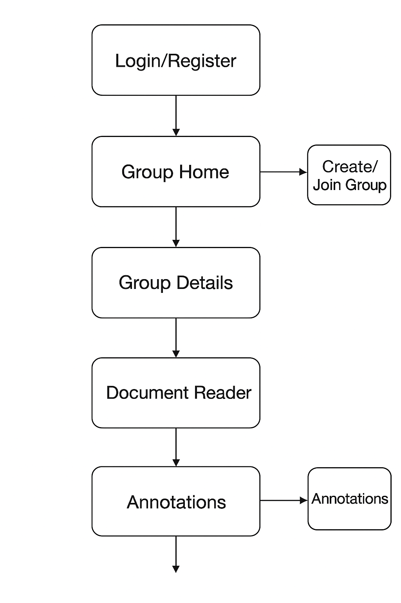

# 📘 ReadTogether 产品文档（MVP版）

## 一、产品需求文档（PRD）

**产品名称**：ReadTogether（暂定名）  
**版本**：V1.0（MVP版）  
**撰写人**：Garuda（PM）  
**日期**：2025.11  

---

### 1. 产品概述
ReadTogether 是一款面向英语学习者的 **多人在线共享文档平台**，支持学习小组共同阅读、划词翻译、笔记批注与讨论，结合AI辅助学习功能，打造“沉浸式协作阅读”体验。

**一句话概述：**  
> “让英语学习像一起看剧一样自然 —— 在线协作阅读、实时讨论、AI助学。”

---

### 2. 产品目标
- 支持小组成员在线共享文档，共同阅读学习资料（PDF、文章、教材）  
- 提供同步阅读、划词翻译、批注、讨论等功能，提升学习互动性  
- 用 AI 助手辅助词汇讲解、生成练习题，增强学习效果  

---

### 3. 目标用户
| 用户类型 | 特征 | 需求 |
|------------|--------|--------|
| 普通英语学习者 | 自学或组队学习 | 想要一起读原文、练习口语、做笔记 |
| 学习社群/小组 | 有共同学习目标的用户群 | 需要共享资料和进度 |
| 教师/辅导员 | 组织学生阅读英文资料 | 希望追踪阅读进度与参与度 |

---

### 4. 用户场景示例
1️⃣ **学习社群阅读活动**  
> “一个英语角小组想共同阅读《The Economist》文章，每天同步阅读一篇，实时划词、讨论。”  

2️⃣ **老师布置阅读任务**  
> “教师上传教材章节，学生在平台上阅读、标注词汇、完成小测。”  

3️⃣ **朋友自学组队**  
> “两三个朋友每晚一起在线读小说、边读边查词，AI 自动解释生词。”  

---

### 5. 功能模块
- 文档管理（上传、共享、预览）  
- 小组协作（创建、加入、成员管理）  
- 阅读器（同步阅读、批注）  
- 划词翻译与AI助学  
- 讨论与互动区  
- 学习记录与统计  

---

## 二、MVP 交互流程图（线框草图）

### 1️⃣ 信息架构
```
ReadTogether（MVP）
├── 登录注册
│   ├── 登录页（邮箱 + 密码）
│   └── 注册页（昵称 + 邮箱 + 密码）
│
├── 小组空间（主界面）
│   ├── 我的组列表（卡片样式）
│   ├── 创建小组（名称 + 简介）
│   └── 加入小组（邀请码输入）
│
├── 小组详情页
│   ├── 文档列表
│   │   ├── 上传文档（PDF、TXT）
│   │   ├── 打开文档
│   │   └── 删除文档
│   ├── 成员列表（头像 + 在线状态）
│   ├── 小组讨论区（简易聊天室）
│
└── 阅读器（核心界面）
    ├── 文档内容区（中间）
    ├── 工具栏（顶部）
    │   ├── 同步模式开关
    │   ├── 批注模式 / 划词翻译
    │   └── AI助手按钮
    ├── 批注区（右侧抽屉）
    │   ├── 我的批注
    │   └── 小组批注
    ├── 讨论区（右侧下方）
    └── 底部状态栏（显示阅读进度）
```

---

### 2️⃣ 交互流程
```
[登录页]
   ↓
[小组首页]
   ├── [创建小组]
   └── [加入小组]
         ↓
   [小组详情页]
         ├── [上传文档]
         ├── [查看成员]
         └── [打开文档]
               ↓
        [阅读器]
         ├── [划词翻译 / 批注]
         ├── [AI 助手释义]
         ├── [小组讨论区]
         └── [同步阅读模式]
```

---

### 3️⃣ 视觉原型（流程图）


